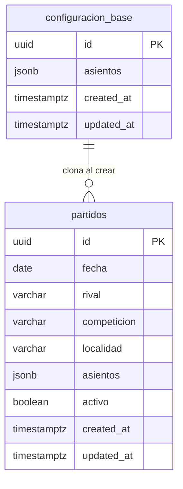
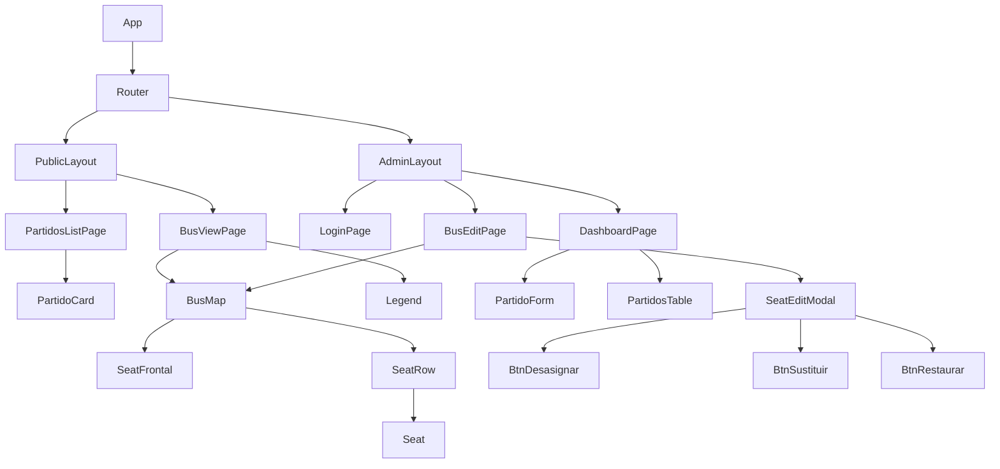

# SDD — Peña Bética Cultural El Arco Rafael Villa
## WebApp Gestión de Plazas de Autobús — Temporada 26/27

---

## 1. Arquitectura

| Capa        | Tecnología                | Justificación                              |
| :---------- | :------------------------ | :----------------------------------------- |
| Frontend    | React 18 + Vite           | SPA rápida, HMR, build estático            |
| Estilos     | Tailwind CSS 3            | Utility-first, grid nativo para el bus     |
| BBDD/Auth   | **Supabase** (PostgreSQL) | Auth integrada, RLS, real-time, SQL        |
| Hosting     | Cloudflare Pages          | Deploy de build estático, dominio custom    |

> Alternativa BBDD: Firebase Firestore (NoSQL). Se descarta por falta de joins y RLS nativo.

```
pena-betica-bus/
├── src/
│   ├── components/
│   │   ├── bus/
│   │   ├── partidos/
│   │   ├── admin/
│   │   └── ui/
│   ├── pages/
│   ├── lib/
│   │   └── supabase.ts
│   ├── hooks/
│   ├── types/
│   └── App.tsx
├── supabase/
│   └── migrations/
├── docs/
│   └── SDD.md
└── package.json
```

---

## 2. Esquema de Base de Datos (Supabase / PostgreSQL)

### 2.1 Modelo relacional



### 2.2 SQL

```sql
-- Plantilla por defecto (singleton: una sola fila)
CREATE TABLE configuracion_base (
    id          UUID PRIMARY KEY DEFAULT gen_random_uuid(),
    asientos    JSONB NOT NULL,          -- array de 78 asientos (Matriz B)
    created_at  TIMESTAMPTZ DEFAULT NOW(),
    updated_at  TIMESTAMPTZ DEFAULT NOW()
);

-- Instancias individuales (un partido = un partido del Betis)
CREATE TABLE partidos (
    id          UUID PRIMARY KEY DEFAULT gen_random_uuid(),
    fecha       DATE NOT NULL,
    rival       VARCHAR(255) NOT NULL,
    competicion VARCHAR(100) DEFAULT 'LaLiga',
    localidad   VARCHAR(50)  DEFAULT 'Local',   -- 'Local' | 'Visitante'
    asientos    JSONB NOT NULL,                  -- copia de configuracion_base.asientos
    activo      BOOLEAN DEFAULT TRUE,
    created_at  TIMESTAMPTZ DEFAULT NOW(),
    updated_at  TIMESTAMPTZ DEFAULT NOW()
);

-- Auth: Supabase Auth gestiona usuarios admin (no tabla propia)
```

### 2.3 Estructura del objeto `Asiento` (JSONB)

```typescript
interface Asiento {
  id:        string;         // "F-I1" (frontal) | "1".."72" (cuerpo)
  numero:    number | null;  // null en frontal, 1-72 en cuerpo
  zona:      "Frontal" | "Cuerpo";
  fila:      number;          // 0 = frontal, 1-18 = cuerpo
  lado:      "Izquierda" | "Derecha";
  posicion:  "Ventana" | "Pasillo" | "Centro";  // Centro = 3er asiento frontal
  estado:    "Libre" | "Ocupado" | "Conductor" | "Guia";
  ocupante:  string | null;
}
```

### 2.4 Flujo de clonado

```
[Admin crea partido] → SELECT asientos FROM configuracion_base
                     → INSERT INTO partidos (..., asientos = copia)
                     → El partido nace con la Matriz B exacta
                     → Modificaciones posteriores solo afectan a ese partido
```

### 2.5 Estados y transiciones (Matriz A)

| Acción admin   | Estado resultante | ocupante resultante | Origen                |
| :------------- | :---------------- | :------------------ | :--------------------- |
| Desasignar     | "Libre"           | null                | Manual sobre partido   |
| Sustituir      | "Ocupado"         | nuevo nombre        | Manual sobre partido   |
| Restaurar      | estado original   | ocupante original   | Copia de config. base  |

### 2.6 RLS (Row Level Security)

| Tabla              | SELECT | INSERT | UPDATE | DELETE |
| :----------------- | :----: | :----: | :----: | :----: |
| configuracion_base | Public | Admin  | Admin  | Admin  |
| partidos           | Public | Admin  | Admin  | Admin  |

---

## 3. Component Tree



### Detalle de componentes

| Componente         | Responsabilidad                                        |
| :----------------- | :----------------------------------------------------- |
| `App`              | Router + provider de Supabase + auth context           |
| `PublicLayout`     | Header + Outlet público                                |
| `PartidosListPage` | Lista de partidos ordenados por fecha (asc)            |
| `PartidoCard`      | Card con fecha, rival, competicion, link al bus        |
| `BusViewPage`      | Mapa de solo lectura del partido seleccionado          |
| `BusMap`           | CSS Grid del autobús (frontal + 18 filas)              |
| `SeatFrontal`      | Zona delantera: chófer, guía, asientos libres          |
| `SeatRow`          | Fila de 4 asientos (2 izq + pasillo + 2 der)            |
| `Seat`             | Asiento individual con color según estado              |
| `Legend`           | Leyenda de colores: Libre, Ocupado, Conductor, Guía    |
| `AdminLayout`      | Guard de auth + sidebar admin                          |
| `LoginPage`        | Form email/password → Supabase Auth                   |
| `DashboardPage`    | Listado de partidos + botón crear                       |
| `PartidoForm`      | Alta de partido (fecha, rival, competicion, localidad) |
| `PartidosTable`    | Tabla CRUD de partidos con link a edición de bus       |
| `BusEditPage`      | Mapa interactivo: clic en asiento abre modal           |
| `SeatEditModal`    | Modal con 3 acciones: Desasignar, Sustituir, Restaurar |

---

## 4. Matriz B — Asientos por defecto (78 plazas)

| Zona            | Asientos | Estado por defecto                        |
| :-------------- | :------: | :---------------------------------------- |
| Frontal Izq     | 3        | CHÓFER (Conductor) + 2 Libre              |
| Frontal Der     | 3        | GUÍA (Guia) + 2 Libre                      |
| Filas 1-15      | 60       | 1-60: Ocupado con nombres de la Matriz B  |
| Filas 16-18     | 12       | 61-72: Todos Libre                        |
| **Total**       | **78**   |                                           |

---

## 5. Stack final y dependencias previstas

| Paquete                | Uso                              |
| :--------------------- | :------------------------------- |
| react / react-dom      | UI                              |
| react-router-dom       | Routing                          |
| @supabase/supabase-js  | Cliente Supabase                 |
| tailwindcss            | Estilos                          |
| vite                   | Bundler                          |
| date-fns               | Formato de fechas (es-ES)        |

---

**SDD completado.** Pendiente de aprobación para iniciar Paso 2.
